# 100_days_of_code

## Dia 1
- Estudei mais sobre dicionários. Explorei a documentação de dicionário no [python.org](https://docs.python.org/pt-br/3/tutorial/datastructures.html) e fiz alguns exercícios de dicionário
- Criei um repositório no Github para o desafio
- Imagem com um dos exercícios  

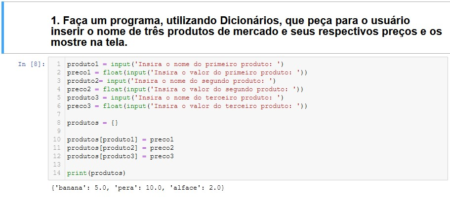

## Dia 2
- Infelizmente estou com COVID19 e não consegui estudar no segundo dia.

## Dia 01 - 20/03/2021
- Por conta da Covid fiquei vários dias sem conseguir estudar. Por isso decidi voltar desde o começo do desafio.
- Assisti vídeo aulas sobre fila do [Prof Isidro](https://www.youtube.com/channel/UCOTem2Sh4zOU3jaeE4HzJcQ)
- Fiz um desafio do CodeWars

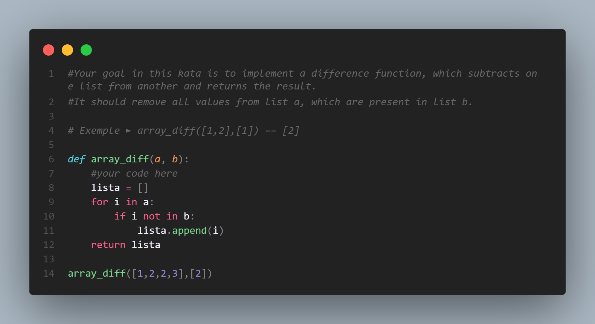

## Dia 02 - 21/03/2021
- Li um artigo sobre orientação a objetos em Java do site do [Dev Media](https://www.devmedia.com.br/introducao-a-programacao-orientada-a-objetos-em-java/26452). Apesar de ser em outra linguagem de programação, que não conheço bem, os conceitos são os mesmo que em Python. Serviu para fixar melhor os conceitos.
- Fiz 2 exercícios no CodeWars

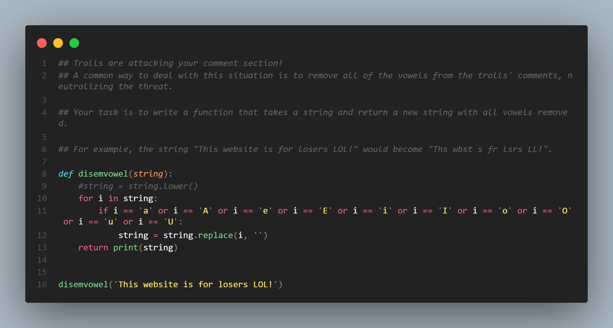

## Dia 03 - 22/03/2021
- Fiz um exercício do CodeWars
- Terminei o módulo de "classes e objetos" do curso de introdução a orientação a objetos na [Alura](https://cursos.alura.com.br/course/python-3-intro-orientacao-objetos)

## Dia 04 - 23/03
- Tentei fazer um kata no CodeWars, mas não consegui terminar ainda. Achei esse bem mais difícil em comparação aos outros.
- Assisti a algumas aulas do curso da [Alura](https://cursos.alura.com.br/course/python-3-intro-orientacao-objetos) de POO.

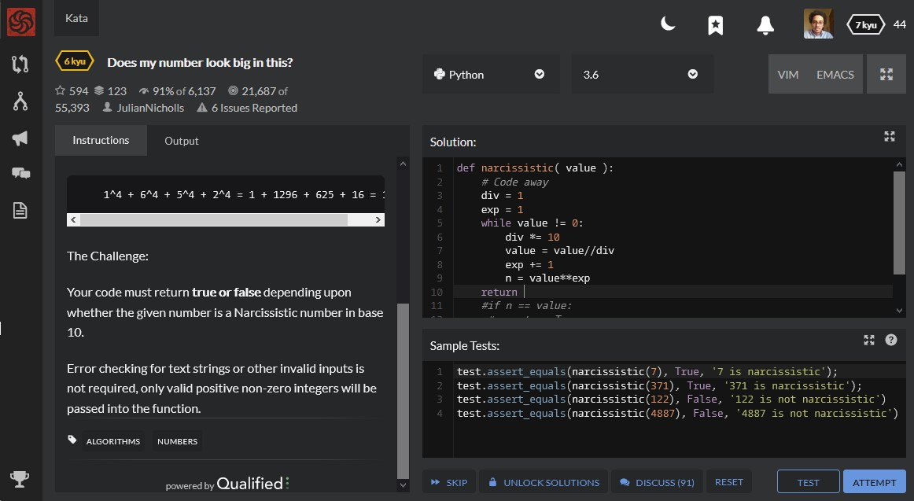

## Dia 05 - 24/03
- Depois de 1h30 em um desafio do CodeWars consegui resolvê-lo parcialmente. De 50 testes 3 continuam dando errado.  
Mas, vi as soluções dos outros usuários e um deles me deu uma luz, resolver o problema através de dicionário. Vou tentar resolvê-lo de outra maneira depois.

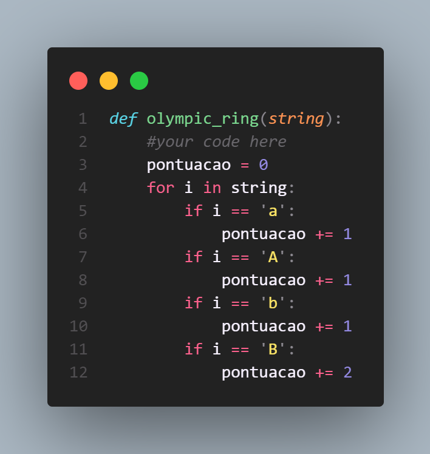

## Dia 06 - 25/03
- Terminei mais um módulo do curso de introdução a POO oferecido pela Alura.

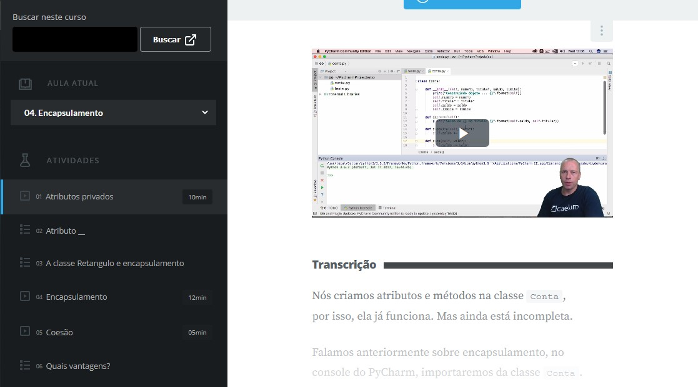

## Dia 07 - 26/03
- Fiz um exercício e meio do CodeWars. O segundo desafio está muito difícil e ainda estou tentando resolver uma parte do desafio. Terei que pesquisar mais sobre como fazer uma das etapas do desafio.

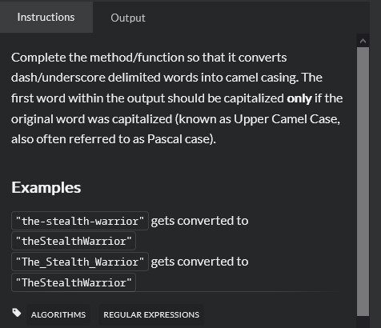

## Dia 08 - 27/03
- Fiz um exercício da Alura de classe e testei a criação de classes criando uma calculadora.

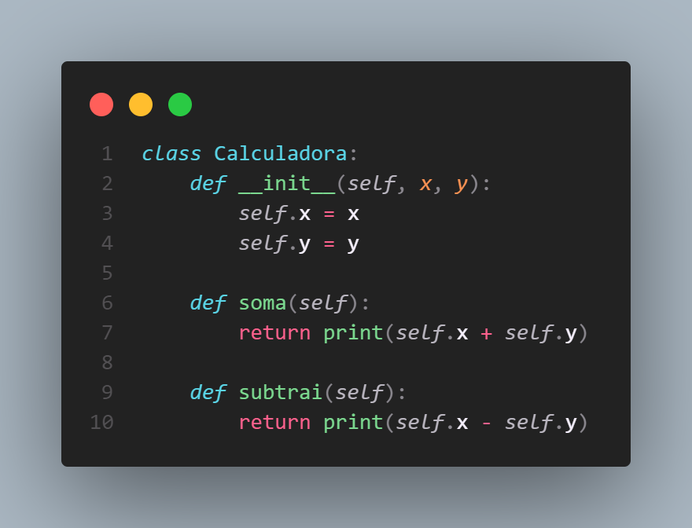

## Dia 09 - 28/03
- Finalizei mais um módulo do curso de introdução a POO da Alura.

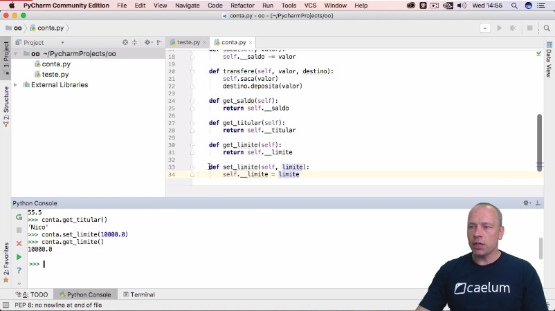

## Dia 10 - 29/03
- Tentei fazer um kata do CodeWars, mas não consegui terminar. O desafio é tirar os hífens de uma palavra e retorná-la toda junta, mas com a primeira letra depois do hífen maiúscula. Por exemplo a entrada 'Felipe-batista' deveria ser FelipeBatista.
Consegui implementar uma lógica que tira apenas um hífen, mas com palavras com mais de um, como 'Felipe-batista-de-souza' ainda não consegui.

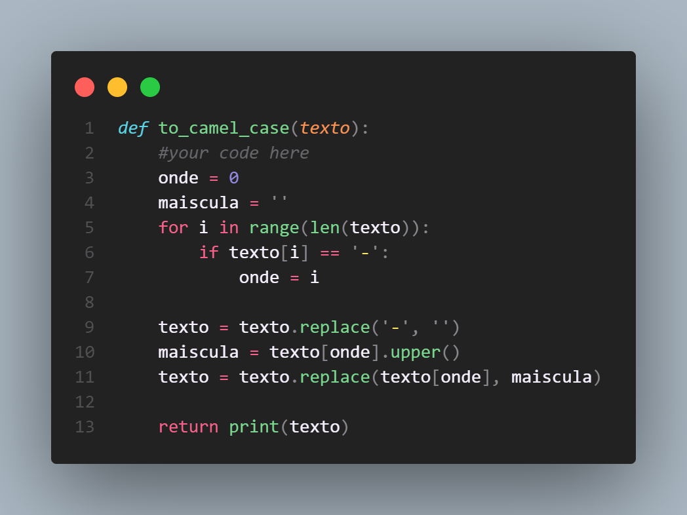

## Dia 11 - 30/03
- Tentei novamente resolver o kata que tira os hífens, mas não consegui
- Assisti um vídeo sobre raspagem de dados. No vídeo ela mostra como é possível coletar dados dos resultados da eleição para presidente da câmara dos deputados.

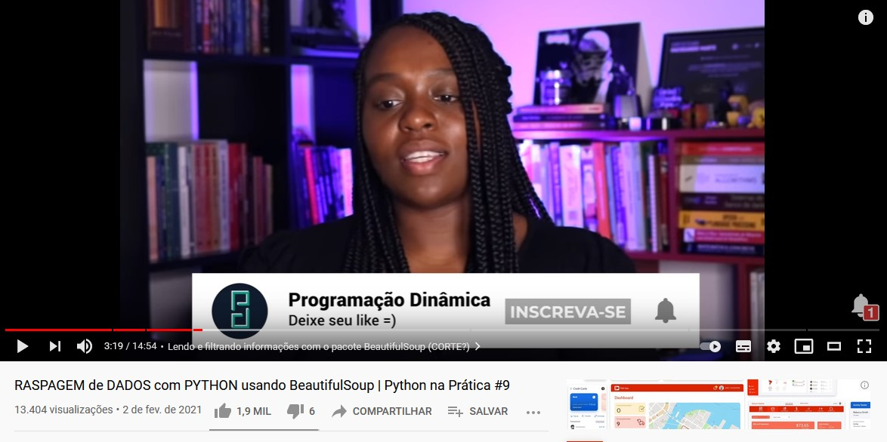

## Dia 12 - 31/03
- Estudei sobre as manipulação de arquivos json com a biblioteca Pandas.

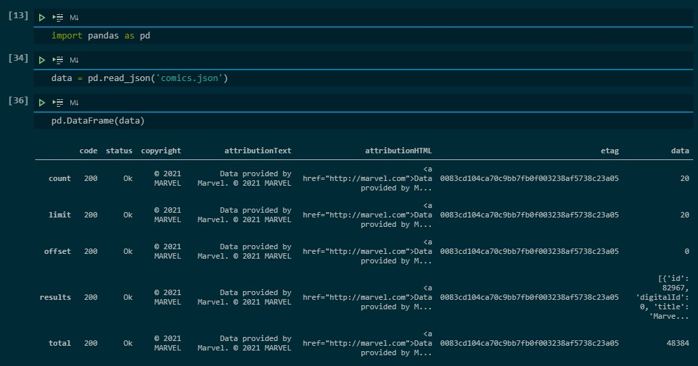

## Dia 13 - 01/04
- Terminei mais um módulo do curso de introdução a POO da Alura

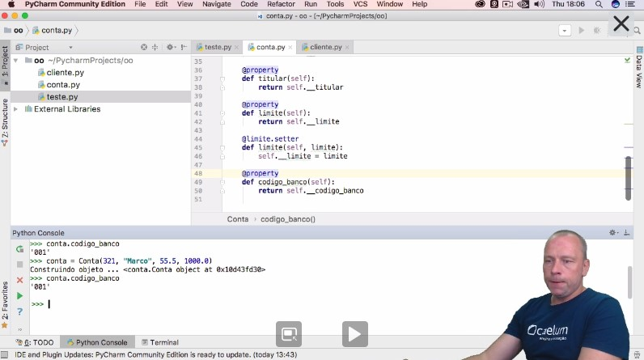

## Dia 14 - 02/04
- Terminei o curso de introdução a POO da Alura.
- Tentei, novamente, resolver o kata que tira os hífens.

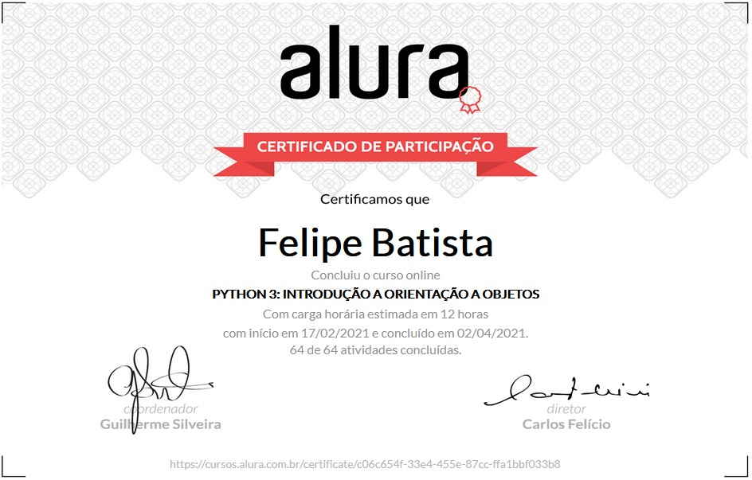

hsuhusah
